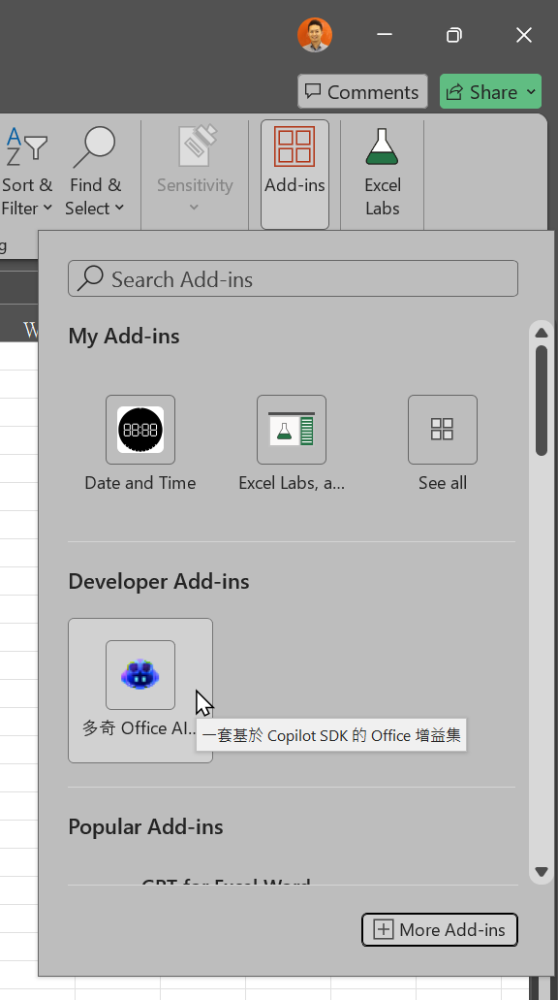
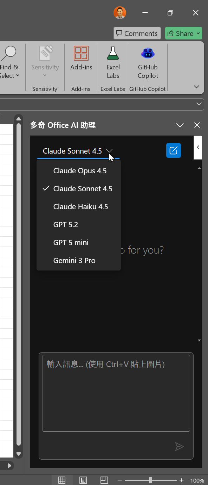

<h1 style="text-align: center;">使用 GitHub Copilot SDK 打造可自動開發的 AI 代理人</h1>
<h1 style="text-align: center;">Joker AI 助手部署指南</h1>


請照著步驟執行即可，服務網址固定是 `https://localhost:52390`！

- **Windows 使用者**：使用標示為「Windows（PowerShell）」的指令
- **macOS 使用者**：使用標示為「macOS」的指令

本文件提供兩種部署方式：

| 方式 | 適用對象 | 優點 |
|------|----------|------|
| **[方式一：從原始碼執行](#方式一從原始碼執行)** | 開發者、需要自訂功能 | 可修改程式碼、即時除錯 |
| **[方式二：從 Docker 執行](#方式二從-docker-執行)** | 一般使用者、快速部署 | 無需安裝 Node.js、環境隔離 |

---

## 事前準備（通用）

### 必要軟體

依據你選擇的部署方式安裝：

| 部署方式 | 需要安裝 |
|----------|----------|
| 從原始碼執行 | [Node.js](https://nodejs.org/)（建議 v18 以上） |
| 從 Docker 執行 | [Docker Desktop](https://www.docker.com/products/docker-desktop/) |

---

## AI 後端說明

本工具支援兩種 AI 後端，擇一使用即可：

| 後端 | 適用對象 | 需要什麼 |
|------|----------|----------|
| **GitHub Copilot** | 有 Copilot 訂閱的使用者 | GitHub PAT Token（自己建立） |
| **Azure OpenAI** | 企業統一部署 | `.env` 檔案（公司提供） |

### 方式一：GitHub Copilot（個人訂閱者適用）

如果你有 GitHub Copilot 訂閱，自己建立 PAT 就能使用。

1. 到 [GitHub PAT 設定頁面](https://github.com/settings/personal-access-tokens/new) 建立 Fine-grained PAT
2. 在 **Permissions** 點「Add permissions」→ 選擇 **「Copilot Requests」**
3. 複製 `.env.example` 為 `.env`，填入 Token：

```env
USE_AZURE_BACKEND=false
COPILOT_GITHUB_TOKEN=github_pat_xxxxxxxxxxxx
```

### 方式二：Azure OpenAI（企業部署適用）

公司統一採購 Azure OpenAI 服務，由管理員提供 `.env` 檔案。

複製 `.env.example` 為 `.env`，填入公司提供的資訊：

```env
USE_AZURE_BACKEND=true
AZURE_OPENAI_ENDPOINT=https://your-resource.openai.azure.com
AZURE_OPENAI_API_KEY=your-api-key-here
AZURE_OPENAI_DEPLOYMENT=your-deployment-name
AZURE_OPENAI_API_VERSION=2025-01-01-preview
```

> **注意**：`.env` 包含機密金鑰，請勿外流或上傳到 GitHub。

---

## 通用設定步驟（兩種方式都需要）

### Step 1：開啟終端機並切換到此資料夾

請確保終端機的工作目錄是**這個部署包資料夾**（包含此 README.md 的資料夾）。

- macOS：

  ```bash
  cd /你下載的路徑/deploy-package
  ```

- Windows（PowerShell）：

  ```powershell
  cd C:\你下載的路徑\deploy-package
  ```

---

### Step 2：產生 SSL 憑證

- macOS：

  ```bash
  ./gen-certs-macos.sh
  ```

  > ⚠️ **macOS 執行權限問題**：如果出現「Permission denied」錯誤，請先執行：
  > ```bash
  > chmod +x ./gen-certs-macos.sh
  > ```
  > 然後再重新執行腳本。

- Windows（PowerShell）：

  ```powershell
  .\gen-certs-windows.ps1
  ```

  > ⚠️ **Windows 執行原則問題**：如果出現「無法載入...未經數位簽署」錯誤，請先執行：
  > ```powershell
  > Set-ExecutionPolicy -Scope Process -ExecutionPolicy Bypass
  > ```
  > 輸入 `Y` 確認後，再重新執行腳本。

完成後，`certs/` 資料夾會出現 `localhost.pem` 和 `localhost-key.pem`。

---

### Step 3：建立 `.env` 設定檔

複製範本並編輯：

- macOS / Linux：

  ```bash
  cp .env.example .env
  ```

- Windows（PowerShell）：

  ```powershell
  Copy-Item .env.example .env
  ```

然後用文字編輯器開啟 `.env`，填入你的金鑰（參考上方「AI 後端說明」）。

---

### Step 4：註冊增益集 + 信任憑證

- macOS：

  ```bash
  ./register.sh
  ```

- Windows（PowerShell）：

  ```powershell
  .\register.ps1
  ```

---

## 方式一：從原始碼執行

> 適合開發者或需要自訂功能的使用者。

### 事前準備

請確認已安裝 [Node.js](https://nodejs.org/)（建議 v18 以上）。

### Step 5：安裝相依套件

```bash
npm install
```

### Step 6：啟動服務

```bash
npm start
```

服務啟動後，終端機會顯示 `https://localhost:52390` 已就緒。

### Step 7：開啟 Office 使用

1. 開啟 Word、Excel 或 PowerPoint
2. 在「常用」功能區找到「GitHub Copilot」按鈕
3. 點擊後即可開始使用

### 日常使用

- **啟動服務**：`npm start`
- **停止服務**：在終端機按 `Ctrl+C`

---

## 方式二：從 Docker 執行

> 適合一般使用者，無需安裝 Node.js 環境。

### 事前準備

請確認已安裝 [Docker Desktop](https://www.docker.com/products/docker-desktop/)。

### Step 5：第一次啟動 Docker 容器

> 這一步只需要做一次。之後用 `docker start copilot-office` 即可。

- macOS / Linux：

  ```bash
  docker run -d --name copilot-office -p 52390:52390 \
    --env-file .env -v "$(pwd)/certs:/app/certs" \
    jokerkang/joker-ai-assistant:latest
  ```

- Windows（PowerShell）：

  ```powershell
  docker run -d --name copilot-office -p 52390:52390 `
    --env-file .env -v "${PWD}\certs:/app/certs" `
    jokerkang/joker-ai-assistant:latest
  ```

---

### Step 6：開啟 Office 使用

1. 開啟 Word、Excel 或 PowerPoint 應用程式

2. 在「常用」功能區找到「GitHub Copilot」按鈕，點擊後即可開始使用

   若找不到按鈕，可以點擊「增益集」→「開發者增益集」，找到「Joker AI 助手」來啟用這個增益集。

   <table>
     <tr valign="top">
       <td></td>
       <td></td>
     </tr>
   </table>

---

### 日常使用（Docker）

#### 啟動服務

```bash
docker start copilot-office
```

#### 停止服務

```bash
docker stop copilot-office
```

#### 查看 log（遇到問題時）

```bash
docker logs -f copilot-office
```

---

## 常見問題（Docker）

### 看到「name already in use」錯誤

代表容器已存在，請先刪除再重新建立：

```bash
docker stop copilot-office
docker rm copilot-office
```

然後重新執行 Step 5 的 `docker run` 指令。

### 修改 `.env` 後設定沒生效

`.env` 只在 `docker run` 時讀取一次。修改後需要**刪除並重建容器**：

- macOS / Linux：

  ```bash
  docker stop copilot-office && docker rm copilot-office && \
  docker run -d --name copilot-office \
    -p 52390:52390 \
    --env-file .env \
    -v "$(pwd)/certs:/app/certs" \
    jokerkang/joker-ai-assistant:latest
  ```

- Windows（PowerShell）：

  ```powershell
  docker stop copilot-office; docker rm copilot-office; `
  docker run -d --name copilot-office `
    -p 52390:52390 `
    --env-file .env `
    -v "${PWD}\certs:/app/certs" `
    jokerkang/joker-ai-assistant:latest
  ```

> **注意**：單純的 `docker restart` 或 `docker stop/start` 不會重新讀取 `.env`。

### Office 找不到增益集按鈕

1. 確認已執行 `register.sh` 或 `register.ps1`
2. 完全關閉 Office 後重新開啟
3. 確認 Docker 容器正在執行：`docker ps`

---

## 移除增益集

如果需要移除增益集：

- macOS：

  ```bash
  ./unregister.sh
  ```

- Windows（PowerShell）：

  ```powershell
  .\unregister.ps1
  ```

> 注意：SSL 憑證不會自動移除。如需移除：
> - macOS：開啟「鑰匙圈存取」搜尋 `localhost` 並刪除
> - Windows：開啟 `certmgr.msc`，在「受信任的根憑證授權單位」中刪除 `localhost`
